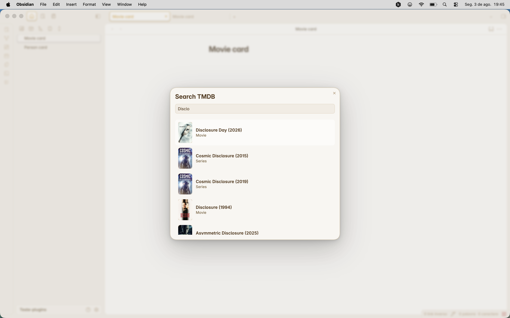
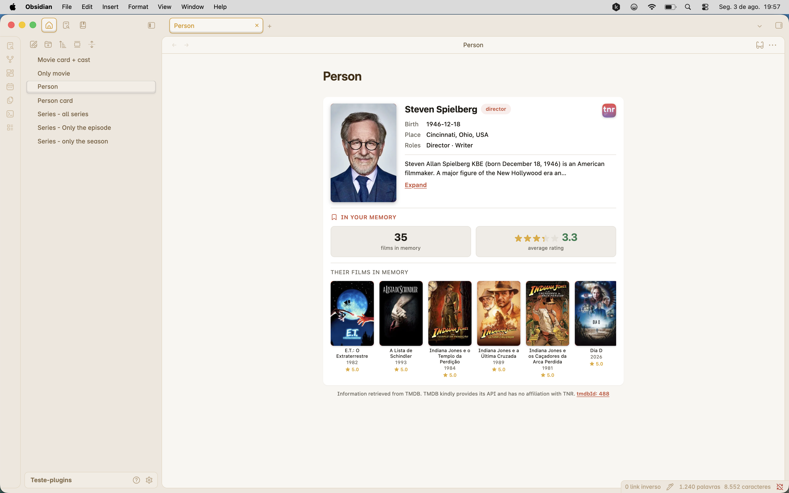
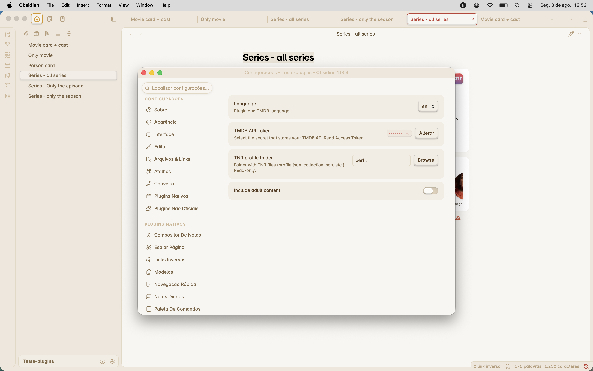

# TNR - Track 'n' Review (Obsidian plugin)

An Obsidian plugin that searches movies, TV series and people on **TMDB** and
inserts embed cards (with or without cast) right at the cursor position. It
also reads your **Track 'n' Review** profile data (free on iPhone, coming soon
on Android) to show stats such as average rating and films you have in memory.

---

## 1. Requirements

- Obsidian (minimum version: 1.11.4).
- A free [TMDB](https://www.themoviedb.org/) account.
- (Optional) The **Track 'n' Review** app on iPhone with an exported profile
  (a folder with `profile.json`, `collection.json`, `memories.json`,
  `diary.json`, `lists.json` and `manifest.json`).

---

## 2. Using the plugin

Open the command palette (`Cmd+P`) and run any of the TNR commands:

| Command | What it does |
|---------|--------------|
| **Add movie/series** | Opens the TMDB search; inserts a card for the selected title. |
| **Add movie/series with cast** | Same as above, but also inserts the cast card. |
| **Add person** | Searches a person (actor, director, etc.) and inserts a card with photo and memory stats. |

### 2.1 Search with autocomplete

Type a title in the search box — results are shown as you type, with
autocomplete, so you can pick the right match (movie, series, season or
episode).



### 2.2 Searching for series, season and episode

For TV series you can jump straight to a specific **season** or **episode**
instead of searching the whole series:

| What you want | How to type it | Example |
|---------------|----------------|---------|
| Whole series | Just the title | `Lost` |
| A specific season | `Title sN` | `Lost s01` |
| A specific episode | `Title sNeMM` | `Lost s01e03` |

The pattern is case-insensitive: `s` = season, `e` = episode. When you type
one of these patterns, the plugin parses it, searches the series by the base
title, then fetches the exact season or episode from TMDB and shows it in the
results. If that season/episode doesn't exist (e.g. `Lost s09`), the search
falls back to a regular title search.

In the results, seasons are labelled `Season N` and episodes show the episode
name followed by the series and the `S01E03` reference. You can navigate the
results with the arrow keys and select with `Enter`, or click with the mouse.

### 2.3 Inserted cards

Cards are inserted at the cursor as a `tnr` code block and rendered in reading
view. Depending on what you select, the plugin inserts different cards:

**Movie card** — poster, title, year badge, original title, and (when
available) director, genres, duration and country, plus a synopsis with
"Expand"/"Collapse" for long texts. A TNR logo links to tnrapp.com and the
footer links to the TMDB page:


**Movie card + cast** — the movie card followed by a **cast card**: a
horizontal carousel with the circular avatars (up to 11) of the main cast who
have a photo, with their names underneath:


**Series card** — same layout as the movie card, using the series name, first
air date as the year and the episode runtime:


**Season card** — series name with a "Season N" subtitle, the season poster and
a "N episodes" duration row:


**Episode card** — a wide 16:9 still as the image, the episode name, a
"SeriesName · S01E03" subtitle, duration and synopsis. With the
"with cast" command it also includes a carousel of the episode's guest stars:


**Person card** — photo, name, role badge (Actor / Director / Writer /
Producer), birth, death, place of birth and biography. When a profile folder
is configured, it also shows a **"In your memory"** section with the number of
their films you have recorded and your average rating (as stars), followed by
a carousel of those films with their ratings:



---

## 3. Configuration

Open **Settings → Community plugins → TNR - Track 'n' Review**.



### 3.1 TMDB API token

1. Go to [themoviedb.org](https://www.themoviedb.org/) and log in or create a
   free account.
2. In your profile, open **Settings → API**.
3. If you don't have a key yet, click **Request an API Key** and fill in the
   form. Choose **Developer** as usage type (personal use) and submit.
4. After approval, the API page shows the **API Key (v3 auth)** section. Copy
   the **API Read Access Token** (the one starting with `eyJ...`).
5. Back in Obsidian, in the **TMDB API Token** field, paste the token. It is
   stored securely in the vault (SecretStorage) — the plugin only keeps a
   reference to it.

### 3.2 Language

In the **Language** dropdown, pick the language used both by the plugin UI and
by the data returned from TMDB (titles, overviews, genres). The change applies
immediately.

### 3.3 Track 'n' Review profile folder

> **Important:** the plugin **only reads** these files — nothing is modified.

1. In the **Track 'n' Review** app (iPhone), export your profile files to a
   folder (via app export, AirDrop, iCloud Files, etc.). The folder contains
   files such as `profile.json`, `collection.json`, `memories.json`,
   `diary.json`, `lists.json` and `manifest.json`.
2. In Obsidian, in the **TNR profile folder** field, click **Browse**.
3. In the folder picker, select the folder that contains your profile
   `memories.json` and confirm.
4. If the folder is valid you'll see a notice such as
   "Profile loaded: N memories". If it doesn't contain the expected file, an
   error message is shown — pick the correct folder.

With the folder configured, person cards start showing memory stats.

### 3.4 Adult content (optional)

Enable **Include adult content** if you want searches to also return adult
titles.

---

## 4. Notes

- **Your settings are saved** in the plugin `data.json` and kept across
  updates.
- If your profile folder changes (new app export), just repeat step 3.3 to
  reload the memories.
- TMDB enforces a request limit (40 per 10 seconds per IP). The plugin uses
  caching to stay within it.

---

## 5. Development

```bash
npm install
npm run dev      # watch mode
npm run build    # production build (tsc + esbuild)
```

Releases are built automatically by GitHub Actions on tag push (see
`.github/workflows/release.yml`).

## License

MIT
